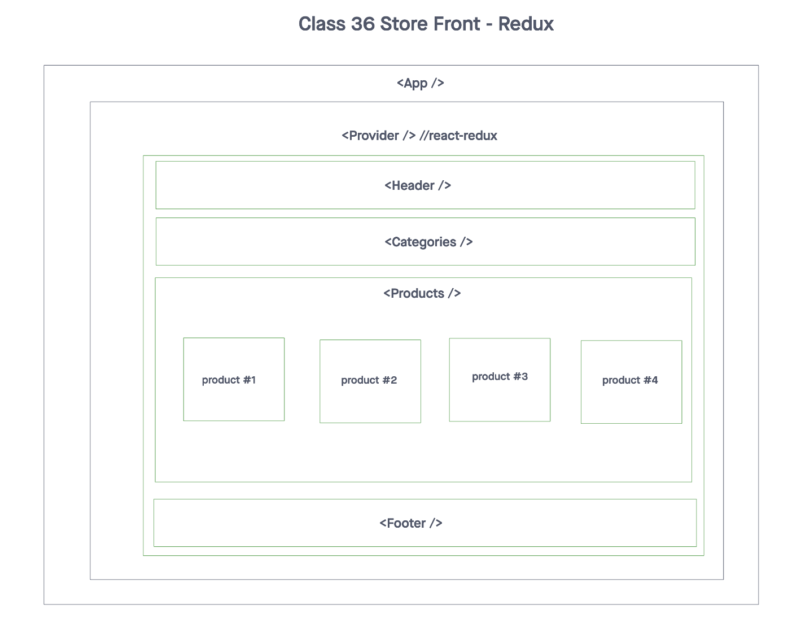
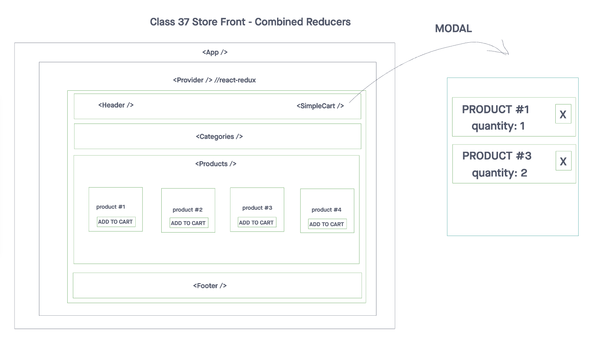
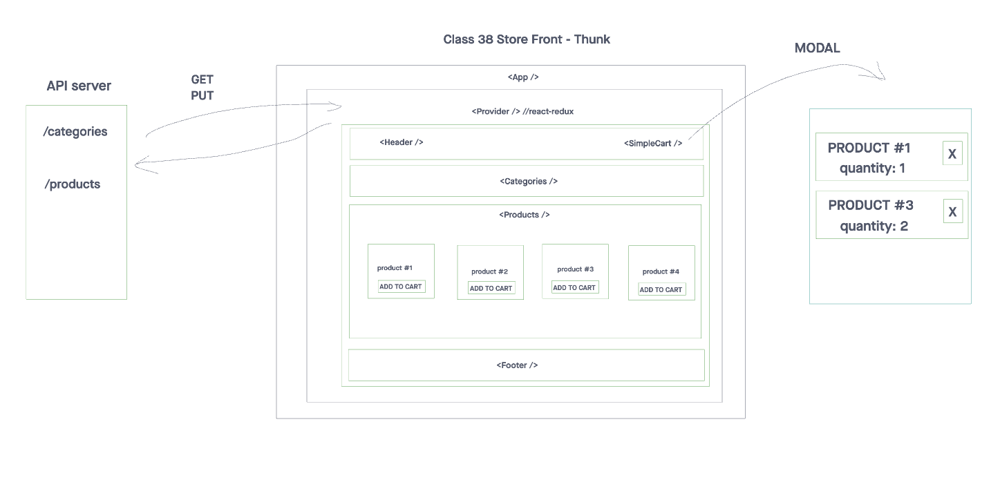

# Koko Depot - Store Front

## Description
This application powers an online storefront that will allow our users to browse our product offerings by category, place items in their shopping cart, and check-out when they are ready to make their purchase

## Features

- Virtual Store Phase 1: Application Setup
> 1. Basic React Application
> 2. Redux State Management
> 3. State managed in memory
> 4. Material UI Components & Styling

- Virtual Store Phase 2: Shopping Cart
> 1. Add items to a shopping cart
> 2. Update quantities
> 3. Remove items from the cart
> 4. Show the cart in real-time on the UI

- Virtual Store Phase 3: Live Data
> 1. Connect the application a live API
> 2. Persist changes to products based on cart activity.

## Table of Contents

1. [Installation](#installation)
2. [Usage](#usage)
3. [UML Diagram](#uml-diagram)
4. [PR Link](#pr-link)
5. [Contributors](#contributors)

## Installation

To get started with the application, follow these steps:

1. Clone the repository to your local machine using this link: [Repository Link](https://github.com/cleecoloma/storefront)
2. Install the required dependencies using the following command:

   ```bash
   npm install
   ```

## Usage

> Test: `npm test`

## UML Diagram




## PR link
[PR Link Class 36](https://github.com/cleecoloma/storefront/pull/1)
[PR Link Class 37](https://github.com/cleecoloma/storefront/pull/2)
[PR Link Class 38](https://github.com/cleecoloma/storefront/pull/3)

## Contributors
* Chester Lee Coloma
* ChatGPT (used for most tests)